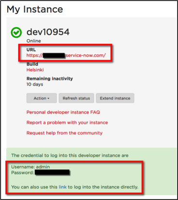

#Exercise:  Obtaining a Developer Instance

ServiceNow offer free, full-featured developer instances to registered users who want to develop applications on the ServiceNow platform or improve their skills with ServiceNow.  We recommend that you obtain a developer instance to do the exercises that are part of this course.

If you already have a personal developer instance, log into the instance as the admin user and skip the rest of this exercise.

Follow these steps to obtain and log in to your personal developer instance. 
 
1.	In a web browser, go to **developer.servicenow.com**.
2.	Log in with your developer site user and password.  If you are not currently a member of the ServiceNow developer site, create an account.
3.	From the menu bar open **Manage > Instance**.
4.	Select the **Request Instance** button.
5.	Select the instance version of your choice.  If the version you would like is not available, select any available previous version.  After the instance is spun up, use the Actions button to upgrade to the version of your choice.  
			**NOTE**:  It is not possible to downgrade versions.
6.	When your instance is available, you will see the instance URL and credentials.

7. The first time you log in, you will be prompted to change your password.  Passwords must be at least 8 characters long and contain a digit, an uppercase letter, and a lowercase letter.

